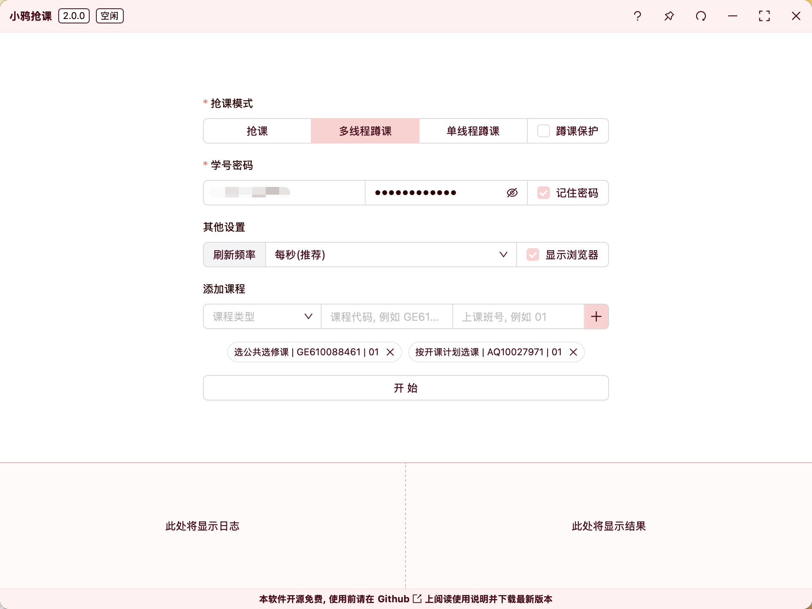

 - **请完整、仔细阅读使用说明, 如果还有问题请提交 `Issue`**
 - **本项目仅供学习交流使用, 开源免费**
 - **请勿用于非法用途, 请严格遵守开源协议, 请勿滥用, 请勿使用此项目牟利, 请自行承担使用此项目的风险**
 - **抢/蹲课成功率并非百分百 (即使软件内提示抢课成功), 请手动确认结果**

# 小鸦抢课

一个使用简单, 开源安全的北师大自动抢课/蹲课程序, 支持公选课/专业课, 支持批量抢课/蹲课, 欢迎点亮 `Star` 关注本项目~

# <mark>使用说明</mark>

## 1 下载安装

**注: 请下载最新版 (即你下载时标注有 `latest` 的版本), 图中的版本可能不是最新的**

> `MacOS` 下软件未签名, 所以 `MacOS` 下可能提示 `软件已损坏`，请参见[这篇文章](https://www.mac2m.com/article/450/)修复，或自行下载源码进行编译 (见文末的 `手动构建方法`), 或安装 `Windows` 虚拟机使用 `Windows` 版本 (不推荐)

## 2 使用说明

**首次开启软件会自动显示教程, 也可以点击右上角的 `?` 图标再次查看教程**

### 2.1 抢课模式详细说明

总而言之, 要抢课就用 `抢课` 模式, 插电蹲课用 `多线程蹲课`, 边上课边蹲课用 `单线程蹲课`

| 模式 | 开启教务页面数 | 如果系统未开启 | 如果可选人数为零 | 多个课程中一个成功 | 多个课程中一个出错 | 速度 | 耗电量 |
| :---: | :---: | :---: | :---: | :---: | :---: | :---: | :---: |
| 抢课 | 每个课程一个 | 刷新 | 退出 | 继续剩余课程 | 继续剩余课程 | 快 | 课程越多越高 |
| 多线程蹲课 | 每个课程一个 | 退出 | 刷新 | 继续剩余课程 | 退出 | 快 | 课程越多越高 |
| 单线程蹲课 | 最多两个 | 退出 | 刷新 | 退出 | 退出 | 课程越多越慢 | 较低 |

### 2.2 课程类别详细说明

北师大的选课系统分为 `按开课计划选课`、`按上课时间选课`、`选公共选修课` 三个大类, 其中 `按开课计划选课` 和 `选公共选修课` 可以选的课程有部分重叠, 而 `按上课时间选课` 则包含了所有课程

小鸦抢课只支持 `按开课计划选课` 和 `选公共选修课` 两个类别, 所以请确保你要选的课程在这两个类别里

对于大一新同学, 一个简单的判断方式是: 你必修的课、专业选修课都不在 `选公共选修课` 里, 且大多数 `选公共选修课` 里的课程的上课班号只有 `01`

### 2.3 都市传说

据传, 选课系统同时只支持约三/四/五（说法不一）个页面同时操作, 小鸦抢课会为每门课都打开一个页面 (`单线程蹲课` 模式除外), 所以如果要同时选多门课, 请自行承担风险 (但是我这边测试的时候, 排除了上面说的其他年级抢课的影响, 同时多线程蹲六门课也是正常的, 所以应该是误传)

# 技术说明

后端基于 `Go`, 前端基于 `TypeScript`, 使用 `Wails`、`React`、`Playwright`、`AntDesign` 等工具或框架开发; 由于抢课时没有选择直接发送请求, 而是以浏览器自动化的方式实现, 所以使用风险较小, 但是效率也会低一些

`1.4.0` 及以前的二进制文件仅在 `Windows` 下测试过, `1.5.0` 及以后的二进制文件仅在 `MacOS` 下测试过, 其他平台如果有问题请提交 `Issue` 或 `Pull Request`

## 手动构建方法

1. 安装 `Go`、`Node.js`、`Bun` (请自行前往官网下载安装)
2. 执行 `go install github.com/wailsapp/wails/cmd/wails@latest` 安装 `Wails`
3. 执行 `git clone https://github.com/LeafYeeXYZ/BNUCourseGetter.git` 克隆本项目
4. 执行 `cd BNUCourseGetter` 进入项目目录
5. 执行 `wails build` 编译项目
6. 在 `build/bin` 目录下找到编译好的二进制文件, 执行即可
