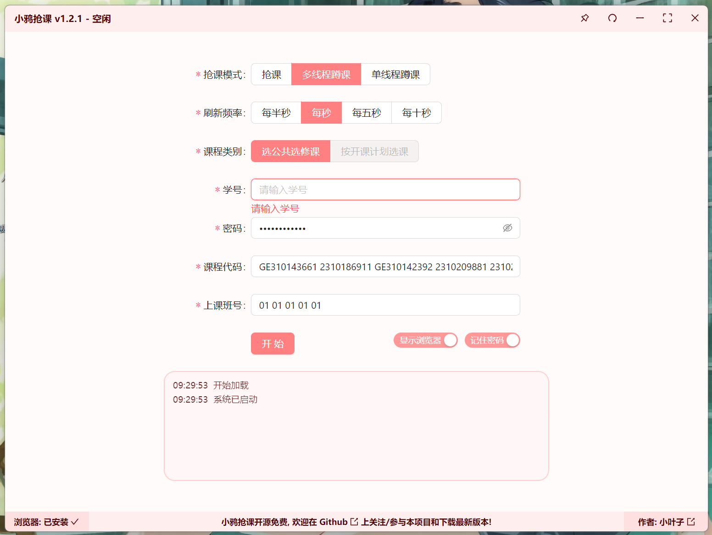
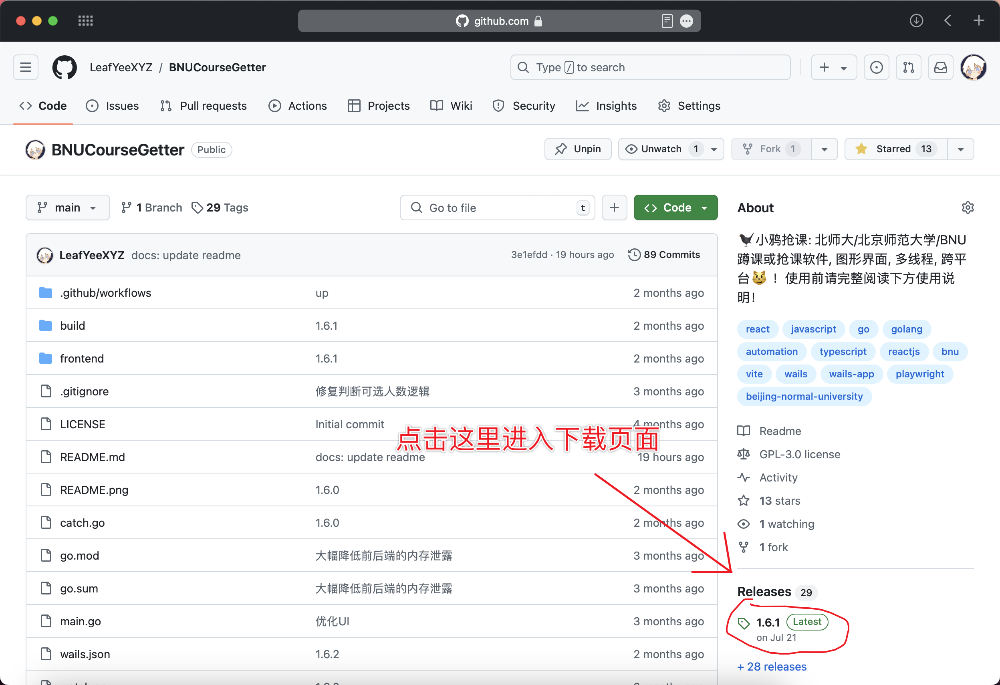
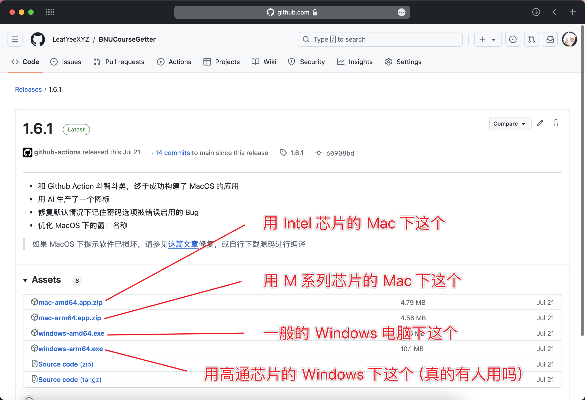
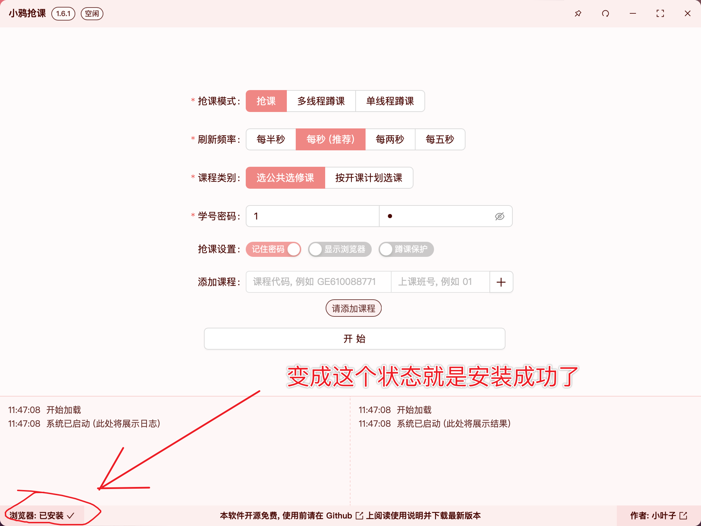
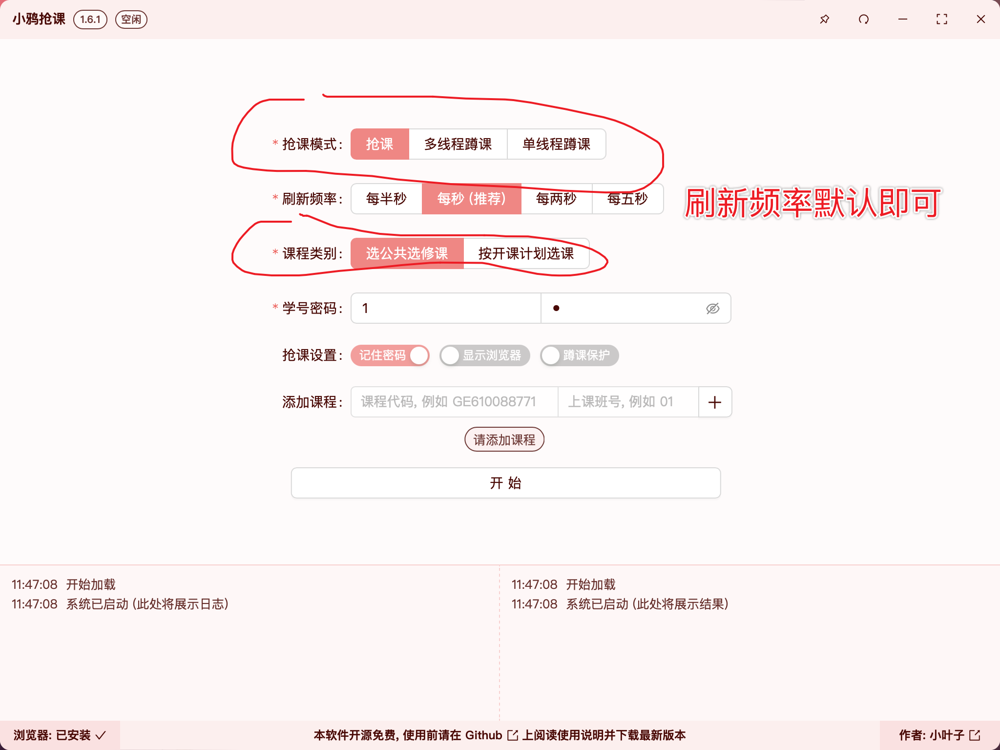
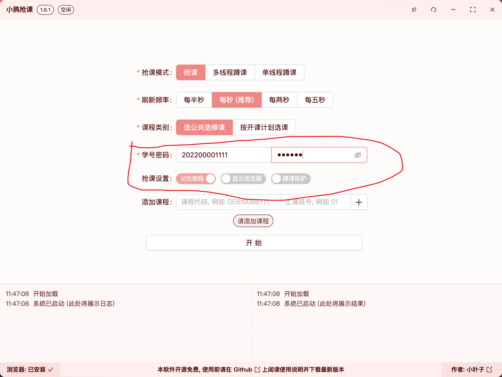
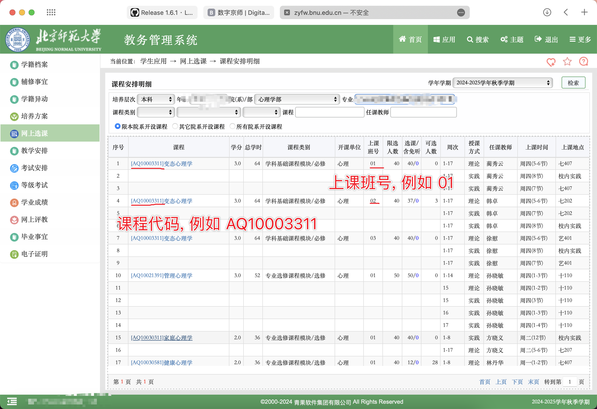
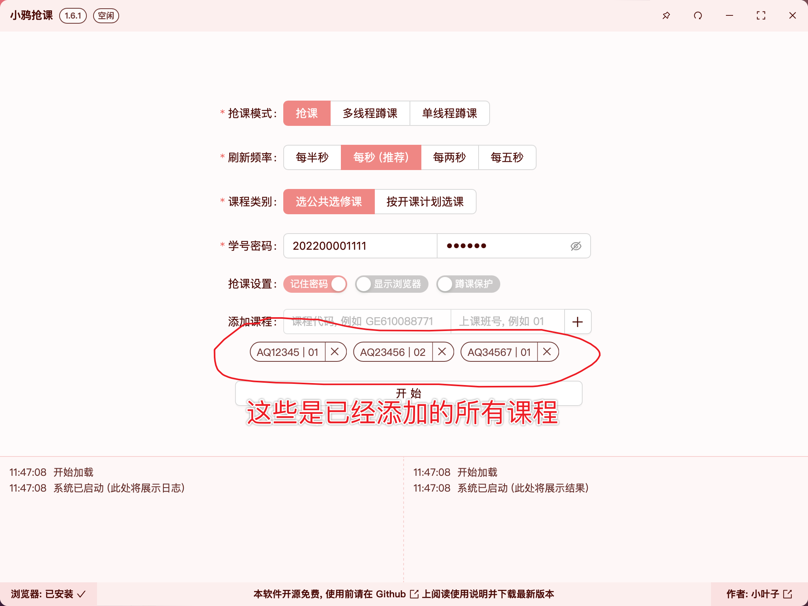
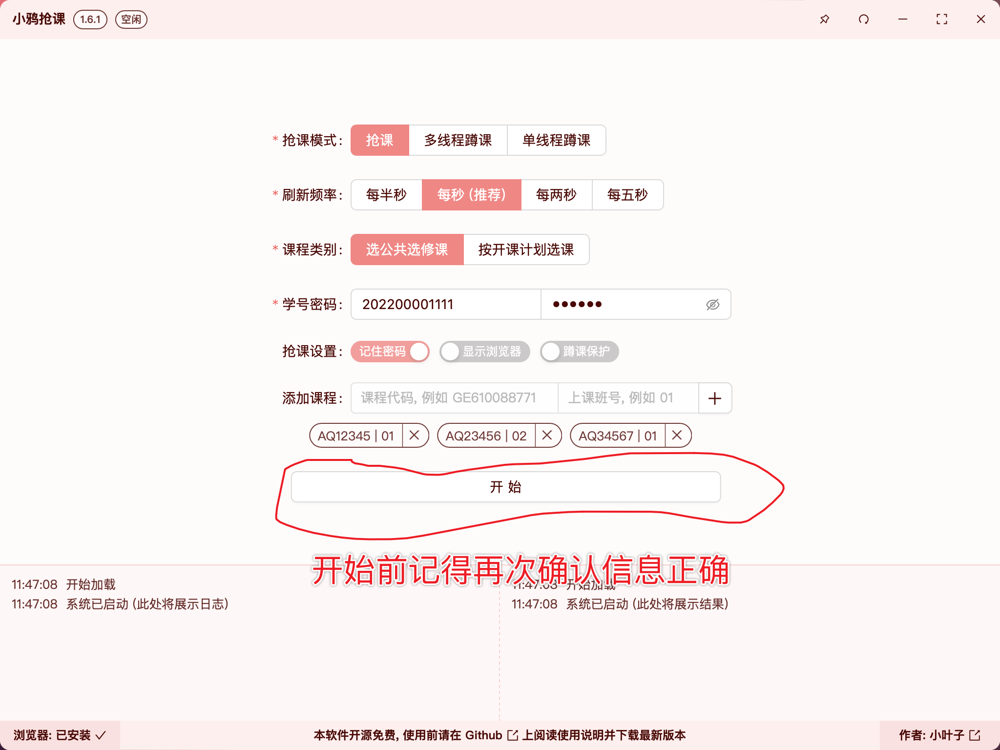

**请完整、仔细阅读使用说明, 如果还有问题请提交 `Issue`; 如果您对计算机使用或北师大抢课系统一无所知, 请勿使用本软件, 本人不提供相关计算机使用教学; 请不要向他人直接分享安装包, 以确保每个使用者都从本页面下载, 并都完整阅读了使用说明; 本项目仅供学习交流使用, 开源免费. 请勿用于非法用途, 请严格遵守开源协议, 请勿滥用, 请勿使用此项目牟利, 请自行承担使用此项目的风险**

# 小鸦抢课

一个使用简单, 开源安全的北师大自动抢课/蹲课程序, 支持公选课/专业课, 支持批量抢课/蹲课, 欢迎点亮 `Star` 关注本项目~

# <mark>使用说明</mark>

## 1 下载安装

> `MacOS` 下软件未签名 (~~贫穷的小叶子买不起贵得要死的 `Apple Developer` 账号~~), 所以 `MacOS` 下可能提示 `软件已损坏`，请参见[这篇文章](https://www.mac2m.com/article/450/)修复，或自行下载源码进行编译 (见文末的 `手动构建方法`)

## 2 等待下载 `chromium`

**第一次**启动时会自动联网下载 `chromium` (浏览器内核, 用来抢课, 见软件界面的左下角), 会消耗一定的时间 (取决于你的网络状况), 请耐心等待; 如果一段时间后显示 `安装失败`, 请重启软件再试一次并确保网络畅通

## 3 选择模式

### `抢课模式` 说明

总而言之, 要抢课就用 `抢课` 模式, 插电蹲课用 `多线程蹲课`, 边上课边蹲课用 `单线程蹲课`; 详细说明如下:

| 模式 | 开启教务页面数 | 如果系统未开启 | 如果可选人数为零 | 多个课程中一个成功 | 多个课程中一个出错 | 速度 | 耗电量 |
| :---: | :---: | :---: | :---: | :---: | :---: | :---: | :---: |
| 抢课 | 每个课程一个 | 刷新 | 退出 | 继续剩余课程 | 继续剩余课程 | 快 | 课程越多越高 |
| 多线程蹲课 | 每个课程一个 | 退出 | 刷新 | 继续剩余课程 | 退出 | 快 | 课程越多越高 |
| 单线程蹲课 | 一个 | 退出 | 刷新 | 退出 | 退出 | 课程越多越慢 | 较低 |

### `课程类别` 说明

北师大的选课系统分为 `按开课计划选课`、`按上课时间选课`、`选公共选修课` 三个大类, 其中 `按开课计划选课` 和 `选公共选修课` 可以选的课程有部分重叠, 而 `按上课时间选课` 则包含了所有课程

小鸦抢课只支持 `按开课计划选课` 和 `选公共选修课` 两个类别, 所以请确保你要选的课程在这两个类别里

对于大一新同学, 一个简单的判断方式是: 你必修的课、专业选修课都不在 `选公共选修课` 里, 且大多数 `选公共选修课` 里的课程的上课班号只有 `01`

## 4 填写信息

请提前确认各项信息填写正确、无课程时间冲突、剩余学分足够、**网络环境流畅** (建议不要去人多的地方抢课)

| 选项 | 说明 |
| :---: | :---: |
| 学号密码 | 你的学号和密码, 所有信息都保存在你的设备本地 |
| 记住密码 | 勾选后, 下次打开程序会自动填写密码 |
| 显示浏览器 | 勾选后, 会显示浏览器窗口, 用于调试; **正常抢课时无需开启** |
| 蹲课保护 | **仅对蹲课生效**. 勾选后, 发生任何错误都会强制重启; 可以避免一些网络错误导致的蹲课中断 |

## 5 添加课程

请首先从教务系统上找到你要选的课程的 `课程号` 和 `上课班号` (如下图所示), 然后填写到软件中, 并点击 `+` 添加一门课程

小鸦抢课支持添加多门课程, 但请确保**所有**添加的课程属于**同一类别** (`按开课计划选课` 或 `选公共选修课`)

## 6 开始抢课

**抢课时, 请提前1-3分钟开启抢课模式即可**; 由于抢课模式下, 小鸦抢课不会通过内部的重启机制来降低内存消耗, 消耗内存会逐渐增加, 所以提前开启太久可能会导致你的设备内存不足 (蹲课模式没有这个问题)

## 7 其他注意事项

- **其他年级抢课开始前后, 教务系统会显示账号已锁定 (详见学校公众号发布的抢课说明), 与小鸦抢课无关**
- 抢课/蹲课的**成功率不是百分之百**, 请在软件提示结束/成功后手动二次确认选课结果; 同时, 千万**不要将本软件作为唯一的选课手段**
- 据传, 选课系统同时只支持约三/四/五（说法不一）个页面同时操作, 小鸦抢课会为每门课都打开一个页面 (`单线程蹲课` 模式除外), 所以如果要同时选多门课, 请自行承担风险 (但是我这边测试的时候, 排除了上面说的其他年级抢课的影响, 同时多线程蹲六门课也是正常的, 所以可能是误传 ~~什么都市传说~~)

# 技术说明
后端基于 `Go`, 前端基于 `TypeScript`, 使用 `Wails`、`React`、`Playwright`、`AntD` 等工具或框架开发; 由于抢课时没有选择直接发送请求, 而是以浏览器自动化的方式实现, 所以使用风险较小, 但是效率也会低一些

`1.4.0` 及以前的二进制文件仅在 `Windows` 下测试过, `1.5.0` 及以后的二进制文件仅在 `MacOS` 下测试过, 其他平台如果有问题请提交 `Issue` 或 `Pull Request`

## 手动构建方法
1. 安装 `Go`、`Node.js`、`Bun` (请自行前往官网下载安装)
2. 执行 `go install github.com/wailsapp/wails/cmd/wails@latest` 安装 `Wails`
3. 执行 `git clone https://github.com/LeafYeeXYZ/BNUCourseGetter.git` 克隆本项目
4. 在项目目录下执行 `wails build` 编译
5. 在 `build/bin` 目录下找到编译好的二进制文件, 执行即可